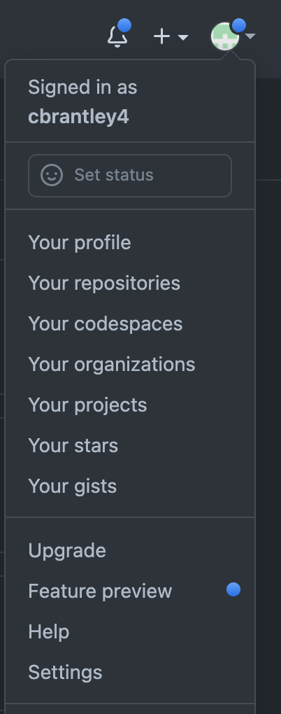
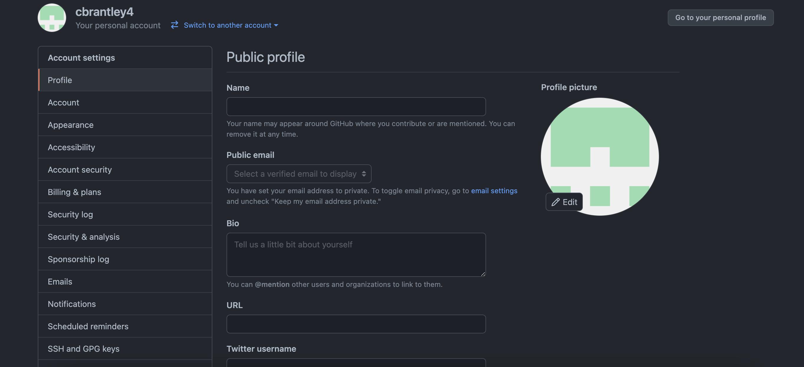
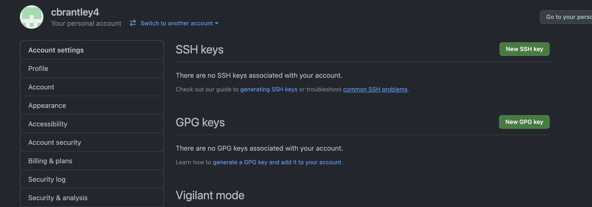

# Setting Up your Development Environment (For Mac Users)

1. Install the [Google Chrome browser](https://www.google.com/chrome/) if you do not already have it
2. Sign-up for [GitHub](https://github.com/). Follow the instructions below to generate a new SSH key for authentication.
3. Follow the directions in this link:
   [How to Configure Your Mac with Z Shell](https://www.freecodecamp.org/news/how-to-configure-your-macos-terminal-with-zsh-like-a-pro-c0ab3f3c1156/)
4. Then, run the following commands in your terminal:
   1. `brew install node`
   2. `brew install git`
   3. `brew cask install visual-studio-code`
5. Check that you have installed everything correctly by running the following commands in your terminal:
   - `node -v`
     - you should see something like `v16.13.1` (the exact numbers may not match)
   - `git --version`
     - you should see something like `git version 2.27.0` (the exact numbers may not match)
   - `code`
     - this should launch a new VS Code window

## Generating a new SSH key
1. Go to your home screen in your terminal. This should have the `~` symbol.

2. Type `ssh-keygen -t ed25519 -C "your_email@example.com"` into your terminal. Replace your_email@example.com with the email address that you used to create your GitHub account.

3. A message will appear that says `Enter file in which to save the key`. Press enter. DO NOT enter anything here. A new file will be created by your computer.

4. A message will appear that says `Enter passphrase`. Press enter WITHOUT entering a password. This message will come up again for the password to be reentered. Press enter again WITHOUT entering a password.

5. In your terminal type `ls -a`. This will display all of the folders on your computer. you should now see one called `.ssh`.

6. Navigate into this folder by typing `cd .ssh`. You should not see this folder name beside the `~`.

7. Type `ls` to list the contents of this folder. You will see at least two files. Both of these will start with ed25519 but one will be followed by `.pub`. These are the public and private keys that were created.

8. Print the contents of the public key that you created by typing `cat id_ed25519.pub`. You will see the name of your key, the public key (a string of random numbers and letters), and your email address printed to the terminal. Copy the entire message.

9. Go to GitHub and click on the profile button in the top right of your screen. In the drop down menu that appears click on `Settings`.

10. On your profile settings page, select the `SSH and GPG keys` from the menu on the left hand side of your screen.

11. Click on the first green button on this page that says `New SSH key`.

12. You will be redirected to a page the asks for you to create the new key. For the title type in SavvyCoders. In the textbox for the key paste in the random string of numbers and letters that you copied in step 8.

13. You will now see that you have an SSH Key associated with your account. You are good to go!
