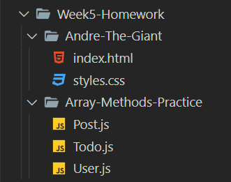

# Homework and Goals

## Goal: _Mastery of these Skills_

- HTML forms and form handling with and without Formspree
- CSS responsive styling, media queries, and positioning with flexbox
- Be able to explain Object-Oriented Programming (OOP) principles
- Create JS Objects with `function` Constructors, create JS classes, and extending prototypes

<br>

## Goal: _Capstone work_

- Add a form to your capstone and activate it through Formspree
- Optimize capstone styling to be Mobile-First and Responsive by using Media Queries and Flexbox
- Find an API online from which you can consume data into your project (like the weather app, Google maps, or WebMD etc.) EG:- [Collection of Free Public APIs](https://github.com/public-apis/public-apis#public-apis--)
- Also add `normalize.css`, Google fonts, a collapsible Nav Bar Hamburger Icon w/ Font Awesome, and a Jumbotron/Hero header (if needed)

<br>

---

<br>

## Homework is due to your TA by next Monday before class
<br>

### _Note:_ **THERE ARE 3 SECTIONS PLUS BONUS THIS WEEK**
<br>

---

<br>

### Homework Set-up

1. Add a "Week5-Homework" _folder_ to your homework repo
2. Inside the folder, create two additonal folders:
    - "Andre-The-Giant"
    - "Array-Methods"
3. Inside the "Andre-The-Giant" _folder_, create `index.html` and `styles.css` files
4. Inside the "Array-Methods-Practice" _folder_, create `User.js`, `Todo.js` and `Post.js` files

An example of the file structure you should have for this assignment is



### CSS Media Queries Practice

**Section 1 of 3**

In the Section 5 Activities Folder, there is a folder called [5-Homework](https://github.com/savvy-coders/sc-curriculum/tree/master/Section05/Activities/5-Homework) that contains two files: `index.html` and `styles.css`.

The `index.html` file is a site about Andre the Giant while the `styles.css` file contains pre-existing styling for the site. Copy the contents of the files linked above into their respective files you created for the "Andre-The-Giant" _folder_ and the do the following:  

In the `styles.css` file, fix the styling for the site, and create a media query that fixes the site to correctly display on the "iPhone 6/7/8" view in DevTools.

Focus on the following:

- The `#bio` `<ul>` at the top of the page
- `` tags
- `<div>` tags
- links

> TIP: you may want to copy-paste some already existing css rules into your media query to make sure you are overwriting the necessary rules.

<br>

---
<br>

### Flexbox Froggy
<br>

**Section 2 of 3**

Go to [flexboxfroggy.com](https://flexboxfroggy.com/) and complete at least half (12), if not all the activities.

Send a screenshot of your progress to your TA when you are finished.

Example screenshot:

<br>

---

<br>

### JS Array Methods Practice

<br>

**Section 3 of 3**

In your Week 5 Homework folder, create the following files:

- User.js
- Todo.js
- Post.js

In the User.js file, use the [placeholder User data](https://jsonplaceholder.typicode.com/users) at [https://jsonplaceholder.typicode.com/users](https://jsonplaceholder.typicode.com/users) to:

- create and print a list of phone numbers
- create and print a list of website and email pairs (pair them in a string, array, or object)

<br>

In the Todo.js file, use the [placeholder To-Do data](https://jsonplaceholder.typicode.com/todos) at [https://jsonplaceholder.typicode.com/todos](https://jsonplaceholder.typicode.com/todos) to:

- create a list of user 9's to-dos
- then find the number of user 9's incomplete tasks

<br>

In the Post.js file, use the [placeholder Post data](https://jsonplaceholder.typicode.com/posts) at [https://jsonplaceholder.typicode.com/posts](https://jsonplaceholder.typicode.com/posts) to:

- create a list of user 5's posts
- then, create a list of title and body pairs

<br>

<b>An example of the output you want is:</b>

```javascript
[
  '1-770-736-8031 x56442',
  '010-692-6593 x09125'
  ],
[
  'hildegard.org, Sincere@april.biz',
  'anastasia.net, Shanna@melissa.tv',
  'ramiro.info, Nathan@yesenia.net'
  ]


[
  {
    userId: 9,
    id: 161,
    title: 'ex hic consequuntur earum omnis alias ut occaecati culpa',
    completed: true
  }
],
[
  {
    userId: 5,
    id: 41,
    title: 'non est facere',
    body: 'molestias id nostrum\n' +
      'excepturi molestiae dolore omnis repellendus quaerat saepe\n' +
      'consectetur iste quaerat tenetur asperiores accusamus ex ut\n' +
      'nam quidem est ducimus sunt debitis saepe'
  }
],
[
  {
    title: 'non est facere',
    body: 'molestias id nostrum\n' +
      'excepturi molestiae dolore omnis repellendus quaerat saepe\n' +
      'consectetur iste quaerat tenetur asperiores accusamus ex ut\n' +
      'nam quidem est ducimus sunt debitis saepe'
  },
]
```

---

## _Bonus Challenge_

Using the [placeholder To-Do data](https://jsonplaceholder.typicode.com/todos) at [https://jsonplaceholder.typicode.com/todos](https://jsonplaceholder.typicode.com/todos) :

- create an object that summarizes the incomplete tasks of users 3, 7, & 8
  - ex:

  ```javascript
  {
    user3: {
      totalTasks: x,
      totalIncomplete: y,
      incompleteTasks: [title1, title2, title3, ...]
    },
    user7: ...
  }
  ```
