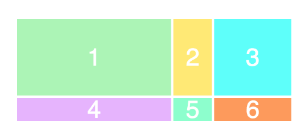
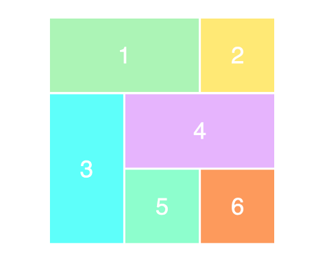

# Single-Page Applications

## **Objective: -**

In this module we'll look at ...

- CSS Grid, a 2D layout model
- SPAs, some pros and cons of Single-Page Applications
- The comparison between pre-SPA and SPA websites
- Essential file structure and component parts of an SPA
- Stateless vs. State-driven SPA applications
- "Serving up" SPA applications
- Model-View-Update (MVU) architecture

<br>

---

<br>

## CSS Grid -- a 2D layout model

<br>

A grid is a set of intersecting horizontal and vertical lines defining columns and rows.

CSS Grid Layout, aka “Grid” or “CSS Grid”, is a **two-dimensional** -- 2D -- layout system which controls columns and rows together (as opposed to the FlexBox one-dimensional layout model). Like tables, the Grid layout enables one to align elements onto the grid within these column and row lines.

### What is the difference between GRID and FlexBox?
GRID and FlexBox are complimentary layout models; there is a good use case for each of these methods.

With FlexBox, creating a auto `wrapping` two-column layout that remains fixed at two-columns, and flows across different screen sizes, is no problem. In the Grid, despite having all kinds of great functions, some things like auto `wrapping` just can't be done.

CSS Grid Layout excels at dividing a page into major regions; Or at defining the relationships -- in terms of size, position, and layer -- between parts of a control built from HTML sections.

The two core ingredients of CSS GRID are the **wrapper (parent)** and the **items (children)**. The wrapper is the actual grid and the items are the content inside the grid.

### **GRID concepts**

#### The GRID Container

To get started you define a container element as a grid in CSS with `'display: grid'`. The element on which `'display: grid'` is applied, is the direct parent of all the grid items/children.

#### Grid Item

The children (i.e. direct descendants) of the `GRID Container` are called the `GRID Items`.

Here, in this example, the `item` elements are grid items, but `sub-item` is not a `GRID Item`.

```HTML
  <div class="container">
    <div class="item"> </div>
    <div class="item">
      <p class="sub-item"> </p>
    </div>
    <div class="item"> </div>
  </div>
```

#### GRID Lines

The dividing lines that make up the structure of the grid are called the `GRID Lines`. They can be either vertical (“column grid lines”) or horizontal (“row grid lines”) and reside on either side of a row or column.

#### GRID Cell

The space between two adjacent row and two adjacent column grid lines, is called a `GRID Cell`. A `GRID Cell` is a **single** “unit” of the grid.

#### GRID Tracks

The space included between two **adjacent** grid lines -- horizontal or vertical -- represents a `GRID track`. You can think of these `tracks` as the columns or rows of the GRID.

#### GRID Area

The total space surrounded by any four grid lines is called a `GRID Area`. A `GRID Area` may be composed of any number of grid cells.

### **Setup a GRID**

1) To get started, define a container element as a GRID. In this example we want to set `wrapper` as the grid container.

```html
  <div class="wrapper">
    <div class="item1">1</div>
    <div class="item2">2</div>
    <div class="item3">3</div>
    <div class="item4">4</div>
    <div class="item5">5</div>
    <div class="item6">6</div>
  </div>
```

2) We setup "wrapper" as a "GRID container" in CSS like this...

```css
.wrapper {
    display: grid;
}
```

3) To make GRID two-dimensional, define columns and rows, and set the column and row sizes for the GRID with `grid-template-columns` and `grid-template-rows`. We could setup our columns and rows in our CSS like this...

```css
.wrapper {
    display: grid;
    grid-template-columns: 200px 50px 100px;
    grid-template-rows: 50px 50px 50px;
}
```

As we’ve written 3 values for `grid-template-columns`, we’ll get 3 columns.
We should get 3 rows, as we’ve specified 3 values for the `grid-template-rows`.

The values dictate how wide columns will be (200px, 50px, 100px) and how tall we’d want rows to be (50px). Here’s the result:



<br>

> NOTE: There are only 2 rows showing in our example image. Why is this?
This is because there are only 6 elements that have been defined in our HTML.
The elements will fill the rows from top to bottom. The first two rows are filled, but as there are no elements to display in the 3rd row we do not see the 3rd row.

<br>

4) The next thing is to define the placement of the child-elements into the parent-GRID using `grid-column` and `grid-row`. To position and resize the items we’ll target the item class (or ID) in CSS, and use the `grid-column` and `grid-row` properties:

```CSS
  .item1 {
      grid-column-start: 1;
      grid-column-end: 3;
  }

  .item3 {
      grid-row-start: 2;
      grid-row-end: 4;
  }

  .item4 {
      grid-column-start: 2;
      grid-column-end: 4;
  }
```

Below is the result of this CSS...



- What we’re saying in the CSS for grid row 1, is that we want `.item1` to start on the 1st column/grid line and end on the 3rd column/grid line. In other words, it’ll take up 2/3s of the row (Positioned from left to right).
- For the 2nd grid row, we set `.item3` to start on the 2nd row/grid line and end on the 4th row/grid line (Positioned from top to bottom).
- Also for the 2nd grid row, we set `.item4` to start on the 2nd column/grid line, and end on the 4th column/grid line (Positioned from left to right).
- The other items are automatically arranged one after another in order as the item Divs appear in the HTML.

>Note: Similarly to flexbox, the source order of the grid items doesn’t matter. Your CSS can place them in any order, which makes it super easy to rearrange your grid with media queries.


<br>

[**IMPORTANT** - Learn all about the different GRID options in this article -- 'A Complete Guide to GRID'](https://css-tricks.com/snippets/css/complete-guide-grid/#aa-introduction)

This article will be very helpful for your homework and completing [GRID Garden](https://codepip.com/games/grid-garden/).

<br>

---

<br>

## What are Single-Page Applications

A **SPA** (**S**ingle-**P**age **A**pplication) is a web development implementation that allows users to use websites without repeatedly requesting and loading new pages from a server. SPAs can improve user experience with faster load times since whole websites can be used without any additional loading of pages.

SPAs also create for a separation of concerns allowing front-end developers to develop websites without server-side jobs and back-end developers to develop features without client-side jobs.

**Search Engine Optimization** (**SEO**) is one potential disadvantage of SPAs. _Some_ SEO Web Crawlers cannot execute JavaScript and therefore cannot access the HTML inside SPA functional components.

We are learning SPAs in "_plain_"/vanilla JS. Starting with vanilla JS now will make it easier in the future to learn any of the available JavaScript **frameworks** meant for SPAs.
Here are a few of the most popular SPA frameworks:

- [Angular](https://angular.io/)
- [React](https://reactjs.org/)
- [Vue.JS](https://vuejs.org/)

<br>

> **NOTE**: Do **NOT** use these frameworks on your capstone, these are just what some of what's available after learning to build an SPA with vanilla JS.

<br>

---

<br>

## Comparing pre-SPA and SPA Websites

<br>

### **Pre-SPA Website**

When we built websites before, all we really "needed" were a few files: our `index.html`, a JavaScript file, and a CSS file.

Below is an example of what a pre-SPA file structure could possibly look like (Ignore anything that was not covered in class. This is **_only an example_**.):


When developing a website, we also needed `live-server` to **serve** our files locally.

In order to expand our website with more pages/views/content, we needed to add _more_ HTML or content files.
Very often, to maintain, a consistent look across our website we end up copying code over and over again.
To make changes to this code we would often need to edit the same code on many different pages. Not an ideal situation.

As we have seen, we can "offload" some HTML content onto JavaScript by using _DOM methods_ to create elements or add content to our page. However, doing this, each `.js` file can grow quite **bloated** with increasingly complex content as our website grows...

After adding a few more HTML pages to our website, our multi-page HTML project folder might possibly look something like this...

Below is an example of what the file structure could possibly look like (Ignore anything that was not covered in class. This is **_only an example_** so don't freak out.):


<br>

### **SPA Website**

SPAs, on the other hand, involve a great deal more files, yet each individual file contains a much more manageable amount of code.

While more files might sound just as hard to manage, additional files used for SPA are contained within one of two new main folders: `components`, and `store` folders.


<br>

### **Essential File Structure of an SPA**

- **`components`** stands for "functional **components**." The `components` folder holds _JS modules_ which _export_ **functions** that populate the HTML document. Each functional component corresponds to a _section_ or page/_view_ of your website.

  - If your site has many "pages"/views, it is common to create a **`views` folder** inside `components` that contains the files for every view/"page"
  - **`store`** represents the _storage_ of the current **state** of the _data_ that populates our site. **State** (or piece of it) is _passed into_ the _functional components_, and the functional components use the data from state to populate the site view. There is no single way to structure `store`, but generally, each piece of your site that you want to keep track of should have a module in `store`.

- **`index.html`** - the `body` of `index.html` will contain only a `div` with an `id` of `root` (`<div id="root"></div>`) and a `script` tag that links to our `index.js`

- **`index.js`** - the root-level `index.js` file contains the `render()` function that targets the `root` `div`, then calls our functional components to _render_ our site.
  This `index.js` file also contains our _event listeners_, since we can only target the elements to listen for events after they have been rendered.

- **`style.css`** - _No change_ from pre-SPA web development. We still need only one stylesheet, and all the same selectors and rules apply.

<br>

### **The importance of having index files**

In the Pre-SPA file structure you had an index.html, index.js, and a style.css file. In the SPA file structure you should notice that these same three files are present, along with some folders.

#### **index.html**

The root (base level) index.html can be thought of as your homepage. This is a page that a user will access by default. When a user attempts to access a website and no path extension is given, the web server will look for the default page.

Take for example the capstone project [Find A Trail](https://findatrail.netlify.app/). Since the address given is `'findatrail.netlify.app'` you are looking at the default page.
If you specify a different path, `'findatrail.netlify.app/Pitt'` for example, the web server knows exactly what page to look for.

As you build out your SPA you will have separate files for each view (or page that you want to look at). The web server is able to understand the path to access each of these views because of the information that is located in the `index.html` file.

#### **index.js**

As you know, any JavaScript file gives a website functionality. The `index.js` file sets itself apart in what it gives functionality to. In the previously mentioned root `index.html`, there is a script tag in the body for the `index.js`. The reason for this is that the root `index.js` gives functionality for the entire web application that you create.


We looked at the new SPA file structure. Each of the folders contain `'.js'` files that will operate on their own (not as part of your SPA) until told otherwise. This is the reason for needing an `index.js` file inside each of these folders. The `index.js` file inside each folder _aggregates_ the files in the folder and makes them functional parts of your web application.

### **Serving an SPA: Bundler/`Parcel`**

`live-server` cannot serve JavaScript modules. You may see an error that says `"import statement cannot be used outside a module"` if you attempt to serve an SPA with a "regular" server simulator like `live-server`.

Instead, we need to use a **bundler** to _build_ our SPA. The bundler we will use is called [**Parcel**](https://www.npmjs.com/package/parcel). Parcel "connects"/compiles all of our files and dependencies into a smaller set of output files that can be used to serve-up our code.

<br>

**To add Parcel to your project:**

1. In your terminal, and in your repo, enter `npm install parcel` to install.

```json
// in package.json
"devDependencies": {
    "parcel": "^2.0.1",
    ...
```

2. Since Parcel is taking the place of `live-server`, we can remove that line from our `devDependencies` (if we didn't install it globally).
   And since we removed `live-server`, we need a new way to serve our page.
   In the `scripts` section of `package.json`, we add the following commands: `parcel-build` and `serve`.

```json
// in package.json
...
"scripts": {
    "parcel-build": "parcel build index.html && cp _redirects ./dist/",
    "serve": "parcel index.html"
  },
...
```

- Now, when we enter `npm run serve` into our terminal when inside our project folder, `parcel` serves up our website instead of `live-server`.

- Entering `npm run parcel-build` "bundles" our files into a smaller set of files inside of a new folder: `dist`.

- We need the second part of `parcel-build` ( "`index.html`" ) to handle our SPA navigation - we want any and all "routes" (web.site/_**route**_) to just render `index.html` since our SPA is only a single page.

- This part of the command ( "`cp _redirects ./dist/`" ) tells `parcel` to **c**opy and **p**aste a file named `'_redirects'` into the `dist` directory it is creating. However, we don't have a `'_redirects'` file yet, so let's make one.

3. In the root directory of your project, `touch`/ create a file named `'_redirects'` (notice the lack of `.` extension).

4. Inside `_redirects`, add this single line of code: `/* /index.html 200`. This tells `parcel` to _redirect_ **any route** ("`/*`") to `index.html`.

5. Now when we run our `parcel-build` script, we shouldn't get any errors.

<br>

---

<br>

## Activity (instructor): Stateless and State-driven SPAs

The instructor will walk though how to convert a "static" pre-SPA website (in this lesson's Activities folder) into, first, a [stateless SPA site](https://github.com/savvy-coders/Stateless-SPA-example), then, a [state-driven SPA site](https://github.com/savvy-coders/State-Driven-SPA-example).

Just follow along for now, we will be diving into each important concept over the next few classes.

What we will end up with is first, a stateless SPA with a folder structure that could possibly look something like this here below.

Below is an example of what the stateless SPA file structure could possibly look like (Ignore anything that was not covered in class. This is **_only an example_** so don't freak out or loose your minds.):


<br>

---

<br>

### **Summary: -**

In this module we'll look at ...

- CSS Grid, a 2D layout model
- Some pros and cons of Single-Page Applications (SPAs)
- The comparison between pre-SPA and SPA websites
- Essential file structure and component parts of an SPA including the `components`, `view`, and `store`
- The comparison between Stateless vs. State-driven SPA applications
- "Serving up" SPA applications with Bundlers
