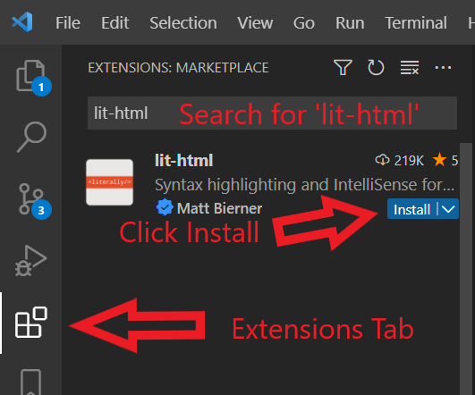

# JavaScript Modules in SPAs

## **Objective: -**

In this module we'll look at ...

- JS modules
- JS `export` statements and **aggregating** exports
- JS `import` statements, and aliasing modules
- [Adding Media and Other Assets to an SPA](#adding-media-and-other-assets-to-an-spa)
- Constructing a functional **Practice SPA** and components

<br>

---

<br>

## JS Modules

**Modules** split JavaScript programs into separate "pieces"/modules that can be _imported_ when needed.

After many years of back-and-forth, the JavaScript module syntax has [finally settled](https://developer.mozilla.org/en-US/docs/Web/JavaScript/Guide/Modules) and is the default module system supported by the many bundlers that are used by developers.

<br>

---

<br>

## JS `export` Statements

The first thing you need to do to get access to module features is **`export`** them. This is done using an `export` _statement_.

We can export just about any feature from the top-level/global scope of a JS file - _functions_, _variables_, _Objects_/_Arrays_, even _Classes_.

<br>

### Named Exports

We can use named exports to export as many features as we want. We can export features "inline" as we declare them, or we can export them after declaration.

```javascript
// "inline" named export
export let x = "x";
export function addTwo(n) => {n + 2};

// exporting after declaration
const y = "y";
function formatListItemHTML(arr) => {
  arr.map(el => `<li>${el}</li>`)
  };
export { y, formatListItemHTML }
```

<br>

### JS `default` Exports

Unlike _named_ exports, there can be **only one** `default` export. Similar to named exports, we can export features "inline" or after declaration.

```javascript
// "inline" default export
export default class Pizza {
  constructor(topping) {
    this.topping = topping;
  }
}
```

```javascript
// default exporting after declaration
export { z as default };
```

<br>

### Aggregating Exports

We can create a parent module (`index.js`) aggregating/_concentrating_ various exports from various modules so they all are available to be imported from the "concentrated"/parent module. When aggregating exports, we can use a shorthand syntax to import and export in the same line:

```javascript
// one-line import/export
export feature from "./path-to-file"

// equivalent to:
import feature from "./path-to-file"
export feature
```

For example, in our `components` folder, we have a module for each section of our HTML that exports a function that injects that HTML content into the website. Also in our `components` folder, we have an `index.js` file - this will be our aggregator.

```javascript
// in Header.js
export default () => `...`;

// in Footer.js
export default () => `...`;

// in index.js (aggregator)
export { default as Header } from "./Header";
export { default as Footer } from "./Footer";
```

<br>

---

<br>

## JS `import` Statements

### Importing Named Features

The syntax for importing named features is similar to the syntax used to export features after declaration - each named feature (one or more) is wrapped in braces and separated by commas. Unlike `export` statements, `import` statements always need to specify _from where_ the modules should be imported.

```javascript
// importing named features
import { x, y, z } from "./path-to-file";
```

<br>

> ### **Aliasing**
>
> Both `import` _and_ `export` statements support **aliasing** or _renaming_ the features as you import or export them. We saw an example of aliasing in the `components` example above where we aliased a `default` export.
>
> ```javascript
> // aliasing in export
> export { reallyReallyLongModuleExportName as shortName };
>
> // aliasing in import
> import { reallyReallyLongModuleExportName as shortName } from "./path-to-file";
> import { default as moduleName } from "./another-path-to-file";
> ```

<br>

### Importing Default Features

When importing default exports, there are two options. If the default export is also named, we can use the name (_without braces_) to import the feature:

```javascript
import myDefaultExport from "./path-to-file";
```

If the default exported feature is _anonymous_, we must import the default export _as_ the `default` keyword,then _alias_ the feature with a new name. When importing a default export as the `default` keyword, we must use an alias because while the exporting file has only one `default`, an importing file can import multiple `default`s and requires a different name for each.

```javascript
import { default as AliasedFeature } from "./path-to-file";
```

<br>

### Importing All Exported Features

We can import **all** features exported from a module by using **`*`**. When we _alias_ the `*`, we create a **Module Object** that "wraps-up" all of our exports, which can then be accessed using dot notation.

```javascript
// imports all features into Module Object
import * as module from "./path-to-file";

// accessing an exported feature from the Module Object
module.featureName;
```

<br>

---

<br>


## Functional Components

In the following activity, we are going to begin the process of converting an existing existing project to a State Driven SPA. We already saw part of this process in 6.1, and if you need a refresher to the key components of an SPA, click here [Section 6 - Comparing pre-SPA and SPA websites](Section06/6.1-SPAIntro.md#comparing-pre-spa-and-spa-websites).

The instructor yesterday gave a demonstration yesterday using the  [Savvy SPA Starter Template](https://github.com/savvy-coders/savvy-spa-starter) as our starting point. As you are going to be using the same template to create your own Class SPA, here is a reminder of the structure of that template:


<br>

Referring back to what we covered in [Section 6.1 - Essential File Structure of an SPA](Section06/6.1-SPAIntro.md#essential-file-structure-of-an-spa), we are going to have "functional components" inside of a `components` folder that holds _JS modules_ which _export_ **functions** that populate the HTML document. Each functional component corresponds to a _section_ or page/_view_ of your website. Keeping in mind that we are utilizing the `savvy-spa-starter` template, let's identify our functional components:

  - We will have 4 _sections_ that will need corresponding functional components: `<header>`, `<nav>`, `<main>` and `<footer>`.

  - We will have four pages/_views_ that we will create functional components for: `Home.js`, `Bio.js`, `Order.js` and `Pizza.js`.

We will go into more specifics in the activity itself, but keep the above in mind as we walk through these steps.

<br>

---

<br>

### Activity Functional Components

1. Use the [Savvy SPA Starter Template](https://github.com/savvy-coders/savvy-spa-starter) to create a new GitHub repo for our practice SPA.

2. Clone the repo to your machine.

3. Update the `README` to reflect that this is a practice SPA.

4. In your terminal, `cd` in your new repo, and instal Parcel as a development dependency by running this command: `npm install -d parcel`

5. In the root, create a `components` folder with the following files inside:

    - Header.js
    - Nav.js
    - Main.js
    - Footer.js
    - index.js

6. Cut each appropriate section from your `index.html` and paste it into a template literal in its corresponding file in `components`:

    - `<header>` --> Header.js
    - `<nav>` --> Nav.js
    - `<section id="jumbotron>` --> Main.js
    - `<footer>` --> Footer.js

7. Nothing should be left inside the `<body>` of your HTML except your `<script>` tag. In the body section, above the script tag, create a `<div>` with an id of "root".

8. Back in the JS files in our `components` folder, we need to `export` our template literals as a **functional component**.

    1. First, in order to make it easier for us to read the HTML inside of our JavaScript files, we are going to use a tool called `html-literal`. To install this, run this command: `npm install html-literal`.

    2. In order for `html-literal` to work properly in your environment, you will need to install the extension `lit-html` in your VS-Code.
        - In VS-Code, go to the Extensions tab.
        - Search for `lit-html`
        - Click Install

        

    3. Go to Header.js, and at the top import "html-literal", and use arrow syntax ( `() =>` ) to modify the template literal to become the output of a one-line function: -

        ```javascript
        // before
        `HTML template literal`;

        // after
        import html from "html-literal";
        () => html`HTML template literal`;
        ```

    4. Then, `export` the function as the `default` export:

        ```javascript
        export default () => html`HTML template literal`;
        ```

    5. Repeat for each JS file in `components` (except `index.js`)

    <br>

9. Each file (except `index.js`) in our `components` folder is now a **functional component** JS module.
    Next we want to _aggregate_ our components in `components/index.js` so we don't have to access each and every module directly. For each module, use the _aggregator shorthand syntax_ to both import and export the module in one line. Alias each `default` export as the module name:

    ```javascript
    export { default as Module } from "./Module";

    //  Example
    export { default as Header } from "./Header";
    ```

10. We have our functional components all set up, but nothing is using or importing them yet. In the "main" `index.js` at the root level our the repo, let's `import` our functional components.

    ```javascript
    // importing all as a Module object
    import * as components from "./components";

    // importing all by name
    import { Header, Nav, Main, Footer } from "./components";
    ```

11. To get our website to finally appear in the browser, we need to create a render function in our root `index.js` that calls our functional components.

    1. Declare a `function` named `render`
    2. Inside the function, query the DOM for the `root <div>` and set its `innerHTML` property to a template literal.
    3. Inside the template literal, call each of the functional components in the order you want them to appear on the page
    4. Call `render` in the body of `index.js`

        ```javascript
        function render() {
          document.querySelector("#root").innerHTML = `
              ${Header()}
              ${Nav()}
              ${Main()}
              ${Footer()}
            `;
        }

        render();
        ```

12. Next, we need to create functional components for the four views we mentioned earlier. We're going to be replicating the same process as above, but with an updated steps as we no longer need the `<header>`, `<nav>`, `<footer>` sections contained in `bio.html`, `order.html` and `pizza.html`. Instead, we will be taking the `<sections>` from each of those files and breaking them into separate, corresponding views much like we broke up the body of our starter HTML.

    1. Inside `components`, create a new folder named `views`

    2. Inside `views`, create a JS file for each view:

       - Home.js (`index.html, section #jumbotron`)
       - Bio.js (`bio.html, section #bio`)
       - Pizza.js (`pizza.html, section #pizza`)
       - Order.js (`order.html, section #order`)

    3. Cut each section from the template literals inside each HTML file above and paste it into a template literal inside its corresponding JS file inside `views`.
       >**NOTE:**  `bio.html`, `pizza.html` and `order.html` are no longer necessary to our project. We can delete these files as the only HTML file we need for our project is `index.html`

    4. In the JS files in our `views` folder, we need to import "html-literal", and `export` our template literals as _functional components_

    5. Create an `index.js` file inside `views` that aggregates our 'views' modules

    6. Inside `components/Main.js`, import all of the `view` functional components as `views`; and inside the template literal, call each functional component you want to appear from the `views` Object:

       ```javascript
       import html from "html-literal";
       import * as views from "./views";

       export default () => html`
         ${views["Home"]()},
         ${views["Bio"]()},
         ${views["Pizza"]()},
         ${views["Order"]()}
       `;
       ```

In the end, our stateless SPA could have a folder structure that looks about something like this example here below.

Below is an example of what our stateless SPA file structure could possibly look like (Ignore anything that was not covered in class. This is **_only an example_** so don't freak out or loose your minds.):


<br>

---

<br>

## Adding Media and Other Assets to an SPA

To add assets like images, files and media to your SPA project, place any assets you may want to include into a folder at the root of your project such as `"assets"`.

If you have many different assets, it could be helpful to separate out categories of assets.
So, the path from the root of the project for an image might be `"assets/img/myImage.jpg"`, or for a video clip might be `“assets/video/video1.m4v"`.

Because of issues with Parcel-Bundler, in order to use images inside of template literals in a view, we need to follow these steps:

1. Navigate into the view file that includes the HTML template literals.
2. Import the image from the assets folder just like you would import a JavaScript module:

    ```javascript
    import myImage from "/assets/img/myImage.jpg";
    ```

3. To use the image imported, you reference the variable in the src attribute of the img tag:

    ```javascript
    
    ```

Here is an example View file:

```javascript
import html from "html-literal";
import sharksImage from "../../assets/IMG_20150708_133155453.jpg";

export default () => html`
  <section id="jumbotron">
    <h2>Savvy Coders Jan. 2020 Cohort</h2>
    <a href="">"Call to Action" "Button"</a>
  </section>
  
`;
```

> NOTE: In order to access the assets folder from our location in the view folder, we must use "../../" before our file path.

<br>

---

<br>

### **Summary: -**

In this module we looked at ...

- The principle component of SPAs - JS modules
- JS `export` statements and **aggregating** exports for reuse in the global scope
- JS `import` statements, and aliasing modules for reuse in the codebase
- Constructing a functional SPA and SPA components
