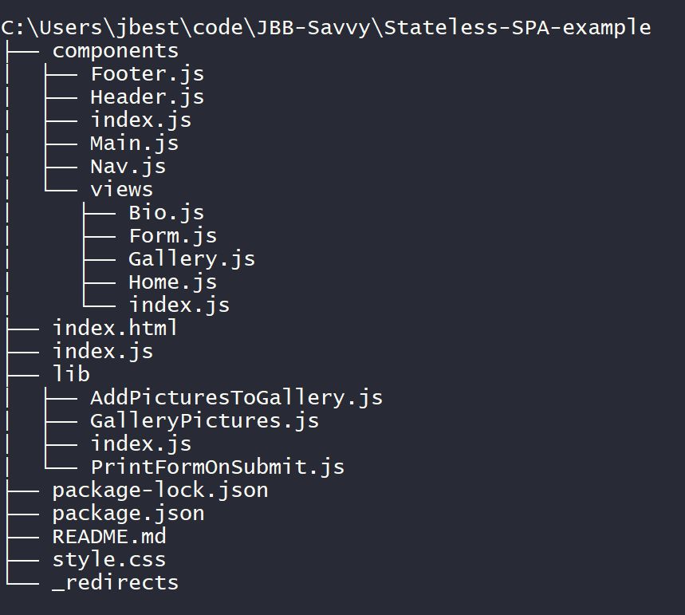

# JavaScript Modules in SPAs

## **Objective: -**

In this module we'll look at ...

- JS modules
- JS `export` statements and **aggregating** exports
- JS `import` statements, and aliasing modules
- [Adding Media and Other Assets to an SPA](#adding-media-and-other-assets-to-an-spa)
- Constructing a functional **Practice SPA** and components

<br>

---

<br>

## JS Modules

**Modules** split JavaScript programs into separate "pieces"/modules that can be _imported_ when needed.

After many years of back-and-forth, the JavaScript module syntax has [finally settled](https://developer.mozilla.org/en-US/docs/Web/JavaScript/Guide/Modules) and is the default module system supported by the many bundlers that are used by developers.

<br>

---

<br>

## JS `export` Statements

The first thing you need to do to get access to module features is **`export`** them. This is done using an `export` _statement_.

We can export just about any feature from the top-level/global scope of a JS file - _functions_, _variables_, _Objects_/_Arrays_, even _Classes_.

<br>

### Named Exports

We can use named exports to export as many features as we want. We can export features "inline" as we declare them, or we can export them after declaration.

```javascript
// "inline" named export
export let x = "x";
export function addTwo(n) => {n + 2};

// exporting after declaration
const y = "y";
function formatListItemHTML(arr) => {
  arr.map(el => `<li>${el}</li>`)
  };
export { y, formatListItemHTML }
```

<br>

### JS `default` Exports

Unlike _named_ exports, there can be **only one** `default` export. Similar to named exports, we can export features "inline" or after declaration.

```javascript
// "inline" default export
export default class Pizza {
  constructor(topping) {
    this.topping = topping;
  }
}
```

```javascript
// default exporting after declaration
export { z as default };
```

<br>

### Aggregating Exports

We can create a parent module (`index.js`) aggregating/_concentrating_ various exports from various modules so they all are available to be imported from the "concentrated"/parent module. When aggregating exports, we can use a shorthand syntax to import and export in the same line:

```javascript
// one-line import/export
export feature from "./path-to-file"

// equivalent to:
import feature from "./path-to-file"
export feature
```

For example, in our `components` folder, we have a module for each section of our HTML that exports a function that injects that HTML content into the website. Also in our `components` folder, we have an `index.js` file - this will be our aggregator.

```javascript
// in Header.js
export default () => `...`;

// in Footer.js
export default () => `...`;

// in index.js (aggregator)
export { default as Header } from "./Header";
export { default as Footer } from "./Footer";
```

<br>

---

<br>

## JS `import` Statements

### Importing Named Features

The syntax for importing named features is similar to the syntax used to export features after declaration - each named feature (one or more) is wrapped in braces and separated by commas. Unlike `export` statements, `import` statements always need to specify _from where_ the modules should be imported.

```javascript
// importing named features
import { x, y, z } from "./path-to-file";
```

<br>

> ### **Aliasing**
>
> Both `import` _and_ `export` statements support **aliasing** or _renaming_ the features as you import or export them. We saw an example of aliasing in the `components` example above where we aliased a `default` export.
>
> ```javascript
> // aliasing in export
> export { reallyReallyLongModuleExportName as shortName };
>
> // aliasing in import
> import { reallyReallyLongModuleExportName as shortName } from "./path-to-file";
> import { default as moduleName } from "./another-path-to-file";
> ```

<br>

### Importing Default Features

When importing default exports, there are two options. If the default export is also named, we can use the name (_without braces_) to import the feature:

```javascript
import myDefaultExport from "./path-to-file";
```

If the default exported feature is _anonymous_, we must import the default export _as_ the `default` keyword,then _alias_ the feature with a new name. When importing a default export as the `default` keyword, we must use an alias because while the exporting file has only one `default`, an importing file can import multiple `default`s and requires a different name for each.

```javascript
import { default as AliasedFeature } from "./path-to-file";
```

<br>

### Importing All Exported Features

We can import **all** features exported from a module by using **`*`**. When we _alias_ the `*`, we create a **Module Object** that "wraps-up" all of our exports, which can then be accessed using dot notation.

```javascript
// imports all features into Module Object
import * as module from "./path-to-file";
// accessing an exported feature from the Module Object
module.featureName;
```

<br>

---

<br>

## Adding Media and Other Assets to an SPA

To add assets like images, files and media to your SPA project, place any assets you may want to include a folder at the root of your project such as `"assets"`.

If you have many different assets, it could be helpful to separate out categories of assets so that the path from the root of the project for an image might be `"assets/img/myImage.jpg"`, or for a video clip might be `“assets/video/video1.m4v"`.

Because of issues with Parcel-Bundler, in order to use images inside of template literals in a view, we need to follow these steps: - 1. Navigate into the view file that includes the HTML template literals. - 2. Import the image from the assets folder just like you would import a JavaScript module:

```javascript
import myImage from "/assets/img/myImage.jpg";
```

To use the image imported, you reference the variable in the src attribute of the img tag:

```javascript

```

Here is an example View file:

```javascript
import html from "html-literal";
import sharksImage from "/assets/IMG_20150708_133155453.jpg";

export default () => html`
  <section id="jumbotron">
    <h2>Savvy Coders Jan. 2020 Cohort</h2>
    <a href="">"Call to Action" "Button"</a>
  </section>
  
`;
```

<br>

---

<br>

## Activity: Functional Components

### Let's refactor our starter files from `6.2-Activities` to use Functional Components

<br>

### To do this we will create a **Practice SPA** following these steps: -

1.  Use the [Savvy Starter Template](https://github.com/savvy-coders/savvy-starter) to create a new GitHub repo for our practice SPA.

2.  Clone the repo to your machine.

3.  Update the `README` to reflect that this is a practice SPA.

4.  Update `package.json`:

    - in `scripts`:

    ```json
    "parcel-build": "parcel build index.html && cp _redirects ./dist/",
    "serve": "parcel index.html"
    ```

5.  In your terminal, `cd` in your new repo, enter `npm install -d parcel-bundler` to install `parcel` as a development dependency.

6.  Create a `_redirects` file with the following line:

    ```javascript
    /* /index.html 200
    ```

7.  Replace the `index.html`, `index.js`, and `style.css` with the starter files from `6.2-Activities`.

8.  Create a `components` folder with the following files inside:

    - Header.js
    - Nav.js
    - Main.js
    - Footer.js
    - index.js

9.  Cut each section from your `index.html` and paste it into a template literal in its corresponding file in `components`:

    - `<header>` --> Header.js
    - `<nav>` --> Nav.js
    - all 3`<section>`s and the `<form>` --> Main.js
    - `<footer>` --> Footer.js

10. Nothing should be inside the `<body>` of your HTML except your `<script>`. Add a `<div>` with an id of "root" above your script tag.

11. Back in the JS files in our `components` folder, we need to `export` our template literals as a **functional component**.

    - 1. First, use arrow syntax ( `() =>` ) to use the template literal as the output of a one-line function.

    ```javascript
    // before
    `HTML template literal`
    // after
    () => `HTML template literal`
    ```

    - 2. Then, `export` the function as the `default` export:

    ```javascript
    export default () => `HTML template literal`;
    ```

    - 3. Repeat for each JS file in `components` (except `index.js`)

12. Each file (except `index.js`) in our `components` folder is now a **functional component** JS module, but we want to _aggregate_ our components in `components/index.js` so we don't have to access each and every module directly. For each module, use the _aggregator shorthand syntax_ to both import and export the module in one line. Alias each `default` export as the module name.

    ```javascript
    export { default as Module } from "./Module";
    ```

13. We have our functional components all set up, but nothing is using or importing them yet. In the "main" `index.js` at the root level our the repo, let's `import` our functional components.

    ```javascript
    // importing all as a Module object
    import * as components from "./components";
    // importing all by name
    import { Header, Nav, Main, Footer } from "./components";
    ```

14. To get our website to finally appear in the browser, we need to create a render function in our root `index.js` that calls our functional components.

    - 1. declare a `function` named `render`
    - 2. inside the function, query the DOM for the `root <div>` and set its `innerHTML` property to a template literal.
    - 3. inside the template literal, call each of the functional components in the order you want them to appear on the page
    - 4. call `render` in the body of `index.js`

15. Next, Let's break up our `components/Main.js` into separate views much like we broke up the body of our starter HTML.

    - 1. inside `components`, create a new folder named `views`

    - 2. inside `views`, create a JS file for each view/"main" section/page

      - Home.js (`section #jumbotron`)
      - Bio.js (`section #bio`)
      - Gallery.js (`section #gallery`)
      - Form.js (`form`)

    - 3. cut each section from the template literal inside `Main.js` and paste it into a template literal inside its corresponding JS file inside `views`. The template literal inside `Main.js` will be empty when each section has been moved to `views`

    - 4. in the JS files in our `views` folder, we need to `export` our template literals as a _functional component_

    - 5. create an `index.js` file inside `views` that aggregates our modules

    - 6. inside `components/Main.js`, import all of the `view` functional components as `views`

    - 7. inside the template literal, call each functional component you want to appear from the `views` Object

16. For the last step, let's "refactor" (rewrite into a better format) our root `index.js` file. We do this to reduce the amount of code in our root `index.js` file. Essentially, we are going to move some of the code out into a library folder, from which we will import the code for reuse.

    - 1. In the root of our project, create a new folder named `lib`

    - 2. Inside `lib`, create the following files:

         - AddPicturesToGallery.js
         - GalleryPictures.js
         - index.js
         - PrintFormOnSubmit.js

    - 3.  Inside our root `index.js` cut out the array "array of pictures for gallery". Past this section into the `GalleryPictures.js` file in the `lib`. Replace the code line "`const dogPictures = [`" with this code line "`export default [`".

    - 4.  Next in the `index.js` cut out the "populating gallery with pictures" section.
          Past this section into the `AddPicturesToGallery.js` file in the `lib`.
          Edit the code to look like this...
          ```javascript
          export default function addPicturesToGallery(pictures, gallery) {
            pictures.forEach((pic) => {
              let img = document.createElement("img");
              img.src = pic.url;
              img.alt = pic.title;
              gallery.appendChild(img);
            });
          }
          ```

    - 5.  Next cut out the "handle form submission" section from the `index.js` file.
          Past this section into the `PrintFormOnSubmit.js` file in the `lib`.
          Edit the code to look like this...
          ```javascript
          export default function printFormOnSubmit(form) {
            form.addEventListener("submit", (event) => {
              event.preventDefault();
              Array.from(event.target.elements).forEach((el) => {
                console.log("Input Type: ", el.type);
                console.log("Name: ", el.name);
                console.log("Value: ", el.value);
              });
            });
          }
          ```

    - 6.  Aggregate our 3 new modules into the `index.js` inside the `lib` folder.
          The code looks like this...
          ```javascript
          export { default as GalleryPictures } from "./GalleryPictures";
          export { default as AddPicturesToGallery } from "./AddPicturesToGallery";
          export { default as PrintFormOnSubmit } from "./PrintFormOnSubmit";
          ```

    - 7.  To use the 3 new modules in our root `index.js`, we first need to import them. Right below the components import, import our modules from the `lib` like this:
          ```javascript
          import {
            AddPicturesToGallery,
            GalleryPictures,
            PrintFormOnSubmit,
          } from "./lib";
          ```

    - 8.  Lastly, we'll use the modules in the `addEventListeners()` function of the root `index.js` file. Refactor the code as follows:

          ```javascript
          function addEventListeners() {
            // add menu toggle to bars icon in nav bar
            document
              .querySelector(".fa-bars")
              .addEventListener("click", () =>
                document
                  .querySelector("nav > ul")
                  .classList.toggle("hidden--mobile")
              );

            // populating gallery with pictures
            const gallerySection = document.querySelector("#gallery");
            // using modules to populate gallery with pictures
            AddPicturesToGallery(GalleryPictures, gallerySection);

            // handle form submission with PrintFormOnSubmit module
            const form = document.querySelector("form");
            PrintFormOnSubmit(form);
          }
          ```

In the end, our stateless SPA could have a folder structure that looks about something like this example here below...



<br>

---

<br>

### **Summary: -**

In this module we looked at ...

- The principle component of SPAs - JS modules
- JS `export` statements and **aggregating** exports for reuse in the global scope
- JS `import` statements, and aliasing modules for reuse in the codebase
- Constructing a functional SPA and SPA components
