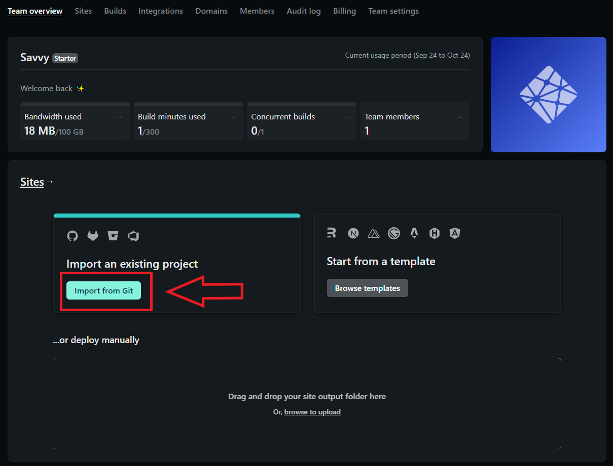
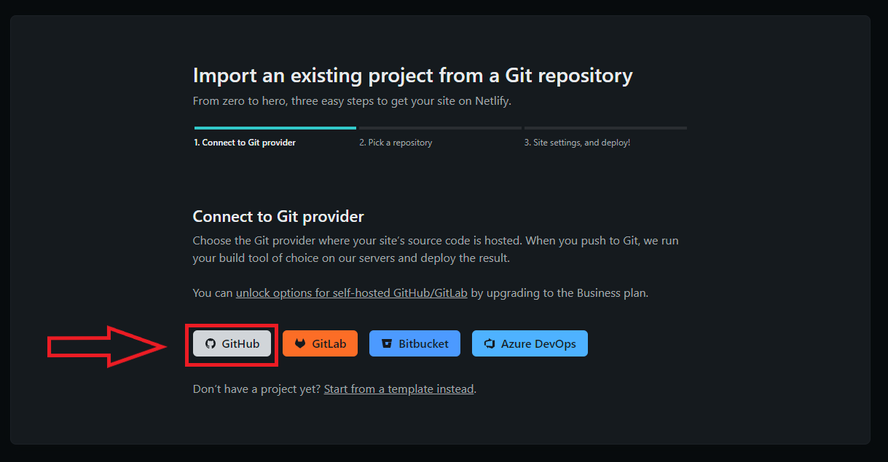
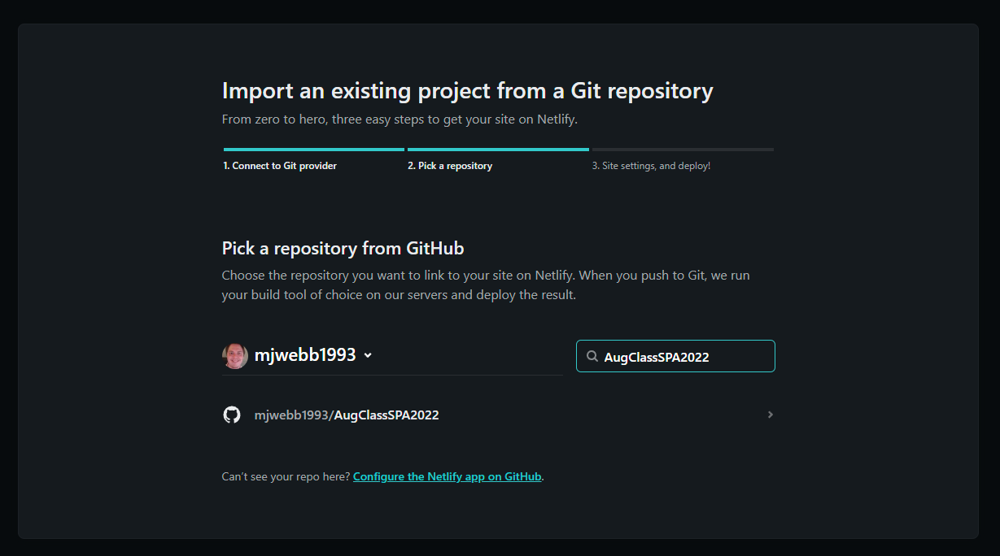
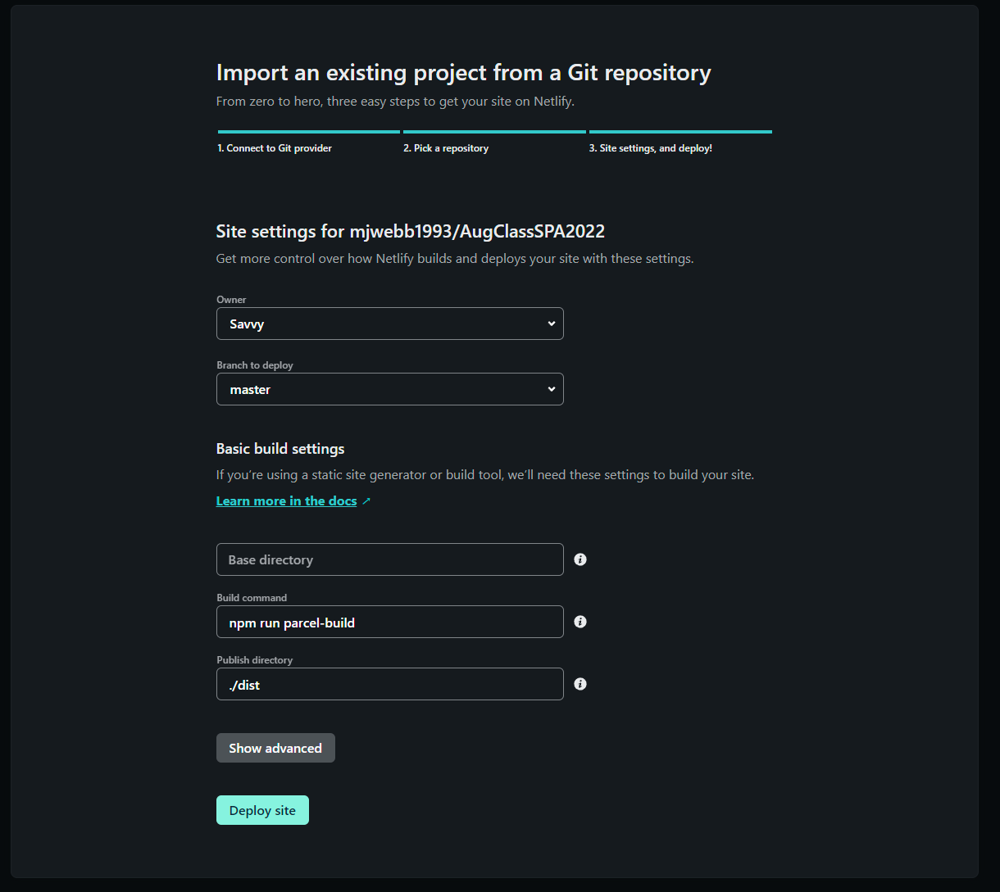
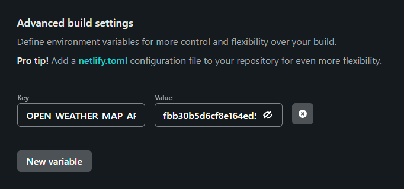
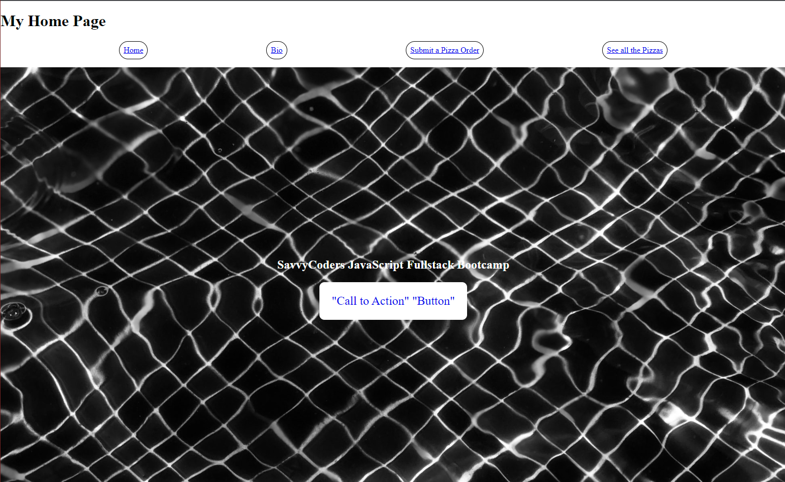
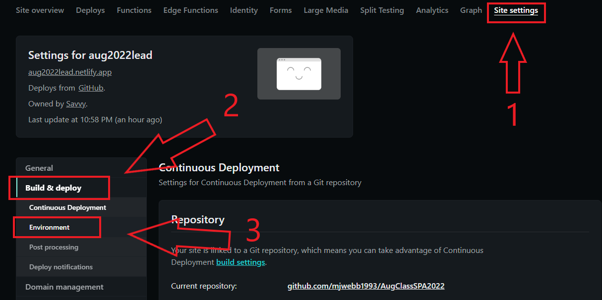
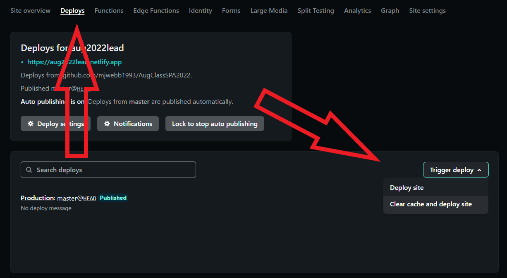

# Securing Environmental Variables and Deploying Your Site To Netlify

## **Objective: -**

In this module we'll look at ...

- Securing environment variables with dotenv
- How to Setup a website Frontend on Netlify using our Practice SPA
- Adding an additional API request into router.hooks for a different view


<br>

---

<br>

### **Securing Environment Variables**

In Section 7.1, we learned about how API keys are used to add a layer of "hoop-jumping" to maintain traffic and help prevent abuse of resources. However, it's not a great idea to have our API keys easily accessible on GitHub, as we have our own security to think of. In that same thought, what about other sensitive information? Even though we won't utilize sensitive information beyond API keys in our Class SPA or Capstones, it is incredibly important to at least know how to secure any variable(s) if need be. In order to accomplish this, we'll be utilizing a third-party module that can create hidden **environment variables**: [`dotenv`](https://www.npmjs.com/package/dotenv).

For class, we'll do the steps below with our Class SPAs so you can use them as reference for the Section 7 Homework.

<br>

---

<br>

### **Activity 1: Securing Environment Variables with dotenv**

1. Install `dotenv`

   ```javascript
   npm install dotenv
   ```

2. Create a `.env` file in the root directory and add our OpenWeatherMap API key to a line:

   ```yaml
   OPEN_WEATHER_MAP_API_KEY=<your OpenWeatherMap API Key here>
   ```

   >**NOTE:** Because these are fixed, "hard" variables, we use upper case and snake case (i.e. UPPER_AND_SNAKE_CASE).

3. We never want to give GitHub access to our `.env` file, so we need to add `.env` to our `.gitignore`.

4. To access our environment variables in a JS file, we need to `import` dotenv. Then we can access our environment variables from the `process.env` Object.

    ```javascript
    import dotenv from "dotenv"

    // Make sure that dotenv.config(); is placed after all of you import statements
    dotenv.config();

    // Remove the appid from the URL inside your .get method and replace it with a template literal that references our 'process.env' Object

    // Before
    axios.get(`https://api.openweathermap.org/data/2.5/weather?q=st%20louis&appid=fbb30b5d6cf8e164ed522e5082b49064`)

    // After
    axios.get(`https://api.openweathermap.org/data/2.5/weather?q=st%20louis&appid=${process.env.OPEN_WEATHER_MAP_API_KEY}`)

    ```

    > Read about [Google API key best practices](https://developers.google.com/maps/api-key-best-practices) for more on safeguarding private information.
<br>

Now that we have secured our API key with dotenv, let's go ahead and push our latest changes to GitHub. If you look at your repository on GitHub, you should not be able to see the .env file, and your API key will be secured so that it won't be seen in your root index.js file! With that accomplished, let's deploy our frontend to Netlify!

---

<br>

Deploying to Netlify is a requirement for your capstone project, and you will have to do this with your project as well.

<br>

### **Activity 2: Setup Frontend on Netlify**

1. Log-in to Netlify (You created a Netlify account on orientation night)

<br>

2. Click "Import From Git"



<br>

3. On the "Create a new site" page, under the "Continuous Deploy" section select the GitHub icon



<br>

4. Under "Pick a repsitory from GitHub" select your repo



5. Under "Site settings", verify that "Branch to deploy" is `master`

6. Under "Basic Build setting" configure your deploy settings

    - For Build Command, enter our build command: `npm run parcel-build`
    - For Publish directory, enter `./dist`

>**IMPORTANT:** IF YOU DO NOT FOLLOW STEPS 5 AND 6 EXACTLY AS SHOWN, YOUR NETLIFY DEPLOY WILL FAIL



7. Click the "Show Advanced" button to reveal "Advanced build settings". Here we can define our "hidden" environment variables.
    - Since we already have environment variables set up for our openweathermap API key, let's go ahead and define an environment variable
    - Go to your .env file in your repository and copy the Key. Paste it into the Key field with the `VARIABLE_NAME` placeholder.
    - Go back to your .env file and copy the value of your key (alphanumerical value) and paste it into the Value field with the `somevalue` placeholder

>**Note:** It is optional to setup your environment variables right now, but you **WILL** have to set up your environment variables before your build will deploy properly.



<br>

8. Deploy the site and customize your domain name -- under 'site overview' -> 'site settings' -- while Netlify builds your site.

<br>

9. We now have a [live website](https://savvycoders-spa-example.netlify.com/) that anyone can access!



<br>

### You can read more about Netlify and how to Deploy a Front End Application with Netlify on freeCodeCamp at [https://www.freecodecamp.org/news/how-to-deploy-your-front-end-app/](https://www.freecodecamp.org/news/how-to-deploy-your-front-end-app/).

<br>

---

<br>

Now that you have a working Netlify deployment, let's talk a little bit about continuous deployment. Every time that you push your master branch to GitHub, Netlify will automatically trigger a new build of your frontend deployment. Convenient, right? Absolutely, however there are situations where we will need to update settings on Netlify to ensure our deployments function properly. Can you think of a scenario where that might be the case?

Well, chances are that you are not always going to have every single environment variable that you will use in your project set up on your first deploy to Netlify, so we need to be able to add environment variables to our site *AFTER* our initial deployment. Let's find out how we can do that *AND* add additional `axios` requests in the next activity.

<br>

---

<br>

### **Activity 3: Get Pizza data with `Axios` for our SPA**

First things first, let's set up our Class SPA to request Pizza data from this API: `https://sc-pizza-api.herokuapp.com/pizzas`

1. To drive home the point that environment variables can be used for more than just API keys, let's use the URL itself as an environemt variable.
    - On a new line in your `.env` file, create a new variabled called `PIZZA_PLACE_API_URL` and set it equal to `https://sc-pizza-api.herokuapp.com/pizzas`
    - Your `.env` file should now look like this:

    ```yaml
    OPEN_WEATHER_MAP_API_KEY=<your OpenWeatherMap API Key here>
    PIZZA_PLACE_API_URL=https://sc-pizza-api.herokuapp.com/pizzas
     ```

    >**NOTE:** Each line `.env` is for a new variable, and we don't separate our variables with commas or semi-colons.

2. Next, much like we did for our `store/Home.js`, we need to add a data collector in our `store/Pizza.js` so we can save the data we pull from our Pizza API in state. Create a key called `pizzas` and assign an empty array to it.

    ```javascript
    export default {
      header: "List of Pizzas",
      view: "Pizza",
      pizzas: []
    };
    ```

    > Note that `pizzas` is initialized as an empty array to reduce the likelihood of an error being produced due to the value being undefined.

3. Navigate to the root `index.js` file and locate the `router.hooks` function. Following the snippet below, update your `switch` statement so it has a `case` for the view `Pizza` that contains an `axios` get request.

    To reiterate, we're going to add a `case` to our `switch` statement in our `router.hooks` function that will contain an `axios` get request to our Pizza API. That might sound like a lot, but let's look at the code and break it down.

    ```javascript
    // New Case for Pizza View
      case "Pizza":
        // New Axios get request utilizing already made environment variable
        axios
          .get(`${process.env.PIZZA_PLACE_API_URL}`)
          .then(response => {
           // Storing retrieved data in state
            store.Pizza.pizzas = response.data;
            done();
          })
          .catch((error) => {
            console.log("It puked", error);
            done();
          });
          break;
    ```

    Nothing that we haven't done before, but now let's see what it looks like when we add it to our `switch` statement.

    ```javascript
    router.hooks({
      before: (done, params) => {
        const view = params && params.data && params.data.view ? capitalize(params.data.view) : "Home";

        // Add a switch case statement to handle multiple routes
        switch (view) {
          case "Home":
            axios
              .get(
                `https://api.openweathermap.org/data/2.5/weather?appid=${process.env.OPEN_WEATHER_MAP_API_KEY}&q=st%20louis`
              )
              .then(response => {
                const kelvinToFahrenheit = kelvinTemp =>
                  Math.round((kelvinTemp - 273.15) * (9 / 5) + 32);

                store.Home.weather = {};
                store.Home.weather.city = response.data.name;
                store.Home.weather.temp = kelvinToFahrenheit(response.data.main.temp);
                store.Home.weather.feelsLike = kelvinToFahrenheit(response.data.main.feels_like);
                store.Home.weather.description = response.data.weather[0].main;
                done();
            })
            .catch((err) => {
              console.log(err);
              done();
            });
            break;
          case "Pizza":
            axios
              .get(`${process.env.PIZZA_PLACE_API_URL}`)
              .then(response => {
                store.Pizza.pizzas = response.data;
                done();
              })
              .catch((error) => {
                console.log("It puked", error);
                done();
              });
              break;
          default :
            done();
        }
      }
    });

    ```

4. Update the HTML in `views/Pizza.js` so it maps out the Pizza data. Format it so it *dynamically* fills populates the rows of the table.
    - This can be accomplished by utilizing the following code:

    ```javascript
    export default st => html`
    <table id="pizzas">
    <tr>
      <th>Crust</th>
      <th>Cheese</th>
      <th>Sauce</th>
      <th>Toppings</th>
      <th>Customer</th>
    </tr>
    ${st.pizzas
      .map(pizza => {
        return `<tr><td>${pizza.crust}</td><td>${pizza.cheese}</td><td>${
          pizza.sauce
        }</td><td>${pizza.toppings.join(" & ")}</td><td>${pizza.customer}</td></tr>`;
      })
      .join("")}

    </table>
    `;
    ```

5. Before we push this to GitHub and check our Netlify deploy, run `npm run serve` and confirm that everything is working as expected locally.

    >**NOTE:** You should always test to make sure any changes to your project work in your local environment before checking to see if it works on a hosted site.

6. Add, Commit and Push to GitHub.

<br>

---

<br>

Now everything is good, right? Nope! Remember before we started this activity that we said we would need to be able to add environment variables to Netlify *after* our initial build. If we went to our deployment right now, our Pizza page would not render and a 401 Error would be thrown in our console. So before we wrap up, let's add our `PIZZA_PLACE_API_URL` environment variable to Netlify.

1. Go to your site page on Netlify and in the Navigation bar, there is a link called `Site Settings`. Click it.
2. On the left hand side of the page, there will be a list of tabs. Click the `Build & deploy` tab.
3. Under `Build & deploy` there is a tab called `Environment`. Click it.



4. Now you will see the `Environment Variables` section, and if you already added your OPEN_WEATHER_MAP_API_KEY, you will see that here as well.
5. Click on `Edit variables` and then `New variable`. Add `PIZZA_PLACE_API_URL` as the Key and `https://sc-pizza-api.herokuapp.com/pizzas` as the Value.

    Now, we're still not finished. In order for changes in *Netlify's* settings to be recognized, you must manually trigger a deploy.

6. In the Navigation bar, click on `Deploys`. Locate and click the `Trigger deploy` button, and on the dropdown menu that appears, click `Clear cache and deploy site`.



<br>

### **Summary: -**

In this module we learned how to secure our environment variables, setup a website Frontend on Netlify, and add an additional API to our `router.hooks`.

This process can be a little tricky as Netlify uses a strict environment and throws and error on every tiny issue.

However, once you get your site up and running you can be sure your frontend code base is syntactically error free.
