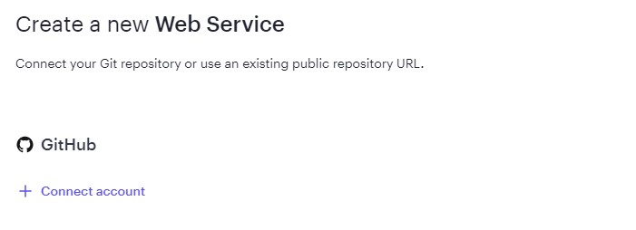
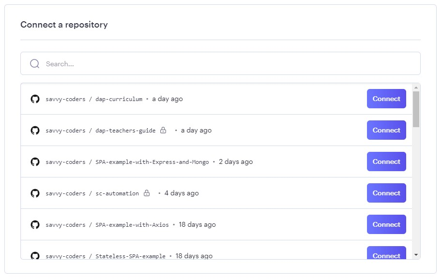
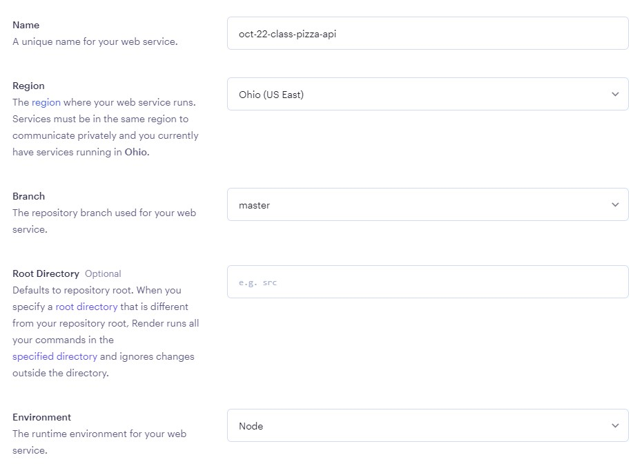
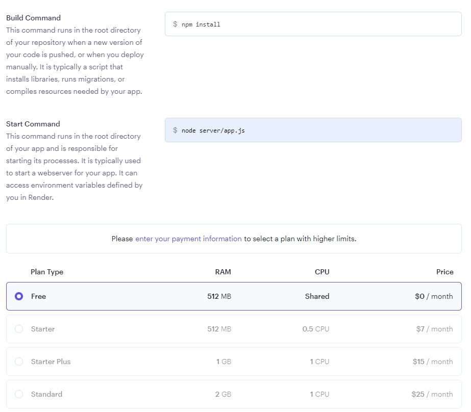
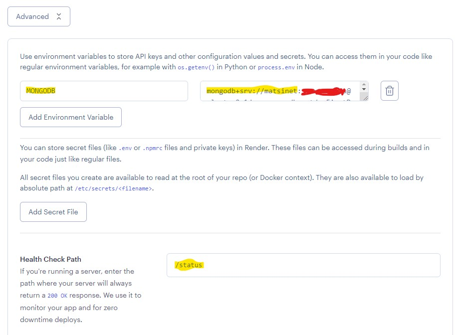
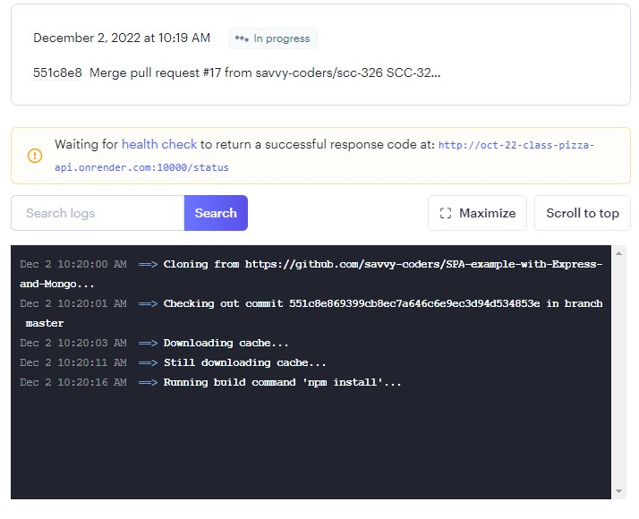
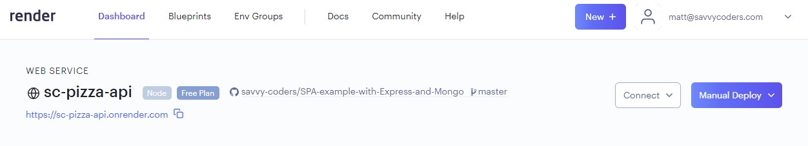

# Hosting the Backend in the Cloud using Render.com and connecting the SPA

### **Objective: -**

In this module we'll look at ...

- Updating the server to handle Cross-Origin Resource Sharing (CORS)
- Host your Express API server on the cloud service Render.com
- Connecting a working class SPA to your REST API server


<br>

## Our project so far ...

<br>

So far, all of our work has been done _locally_. This is common for development, but not very useful for APIs that we want to share with others.

You'll recall that our single-page app has both a local version (called "development") and a public version (called "production") which both track the `master` branch of your project's `git` repository.

<br>

---

<br>

## Updating the server to handle Cross-Origin Resource Sharing (CORS)

**Cross-Origin Resource Sharing (CORS)** is an HTTP-header based mechanism that allows a server to indicate any other origins (domain, scheme, or port) than its own, from which a browser should permit loading of resources.

For security reasons, modern browsers restrict cross-origin HTTP requests initiated from scripts.

> Read more about CORS at: https://developer.mozilla.org/en-US/docs/Web/HTTP/CORS

<br>

Let's add a CORS middleware to the `server/app.js` that adds the necessary headers and, in our case, _allows any origin to access our server_.

> Note: This isn't advised for a production application and violates every security measure, so don't do this in a real enterprise application.

<br>

Right below where the logging middleware is defined add the CORS middleware

```node
// CORS Middleware
const cors = (req, res, next) => {
  res.setHeader(
    "Access-Control-Allow-Headers",
    "X-Requested-With,content-type, Accept,Authorization,Origin"
  );
  res.setHeader("Access-Control-Allow-Origin", "*");
  res.setHeader(
    "Access-Control-Allow-Methods",
    "GET, POST, OPTIONS, PUT, PATCH, DELETE"
  );
  res.setHeader("Access-Control-Allow-Credentials", true);
  next();
};
```

Now we need to use the CORS middleware for it to be functional. Let's add the use statement next the the `app.use(logging);` statement.

```node
app.use(cors);
```

<br>

---

<br>

## The Frontend

<br>

We used Netlify to deploy the public version of our single-page-app (frontend), but Netlify is built to serve primarily static content (like HTML, CSS, and JavaScript files) in what's called a **"serverless" environment \***.

Serverless environments do not support the kind of long-running services that we've just written; as you might expect, it's difficult to deploy a "server" to a platform that is explicitly "serverless".

<br>

## Render.com Deployment

<br>

To host our `express` API server (backend), we'll use a another platform for deploying `git`-based long-running processes called [Render.com](https://www.render.com/). We will then connect our API server to the MongoDB Atlas instance using the appropriate environment varibles.

<br>

Let's walk through deploying our API to Render so that we can share our Pizza Store with the world!

<br>

---

<br>

### What is a Serverless Environment or Service?

Serverless architecture (also known as serverless computing or function as a service, FaaS) is a software design pattern where applications are hosted by a third-party service -- like Netlify-- eliminating the need for server software and hardware management by the developer.

"Serverless" refers to services that mask (abstract away) the details of the server etc. from the user. It's all about a contract and defined communication (API) between two parties who handle separate concerns.

Serverless does not mean servers are no longer needed, just that they are not user-managed or controlled.

In this model the provider dynamically allocates — and then charges (or not) the user for — only the compute resources and storage needed to execute a particular piece of code.

<br>

---

<br>

### Activity: Deploying our API server to Render

<br>

1. Make sure that you've signed up for a free Render account first! This will require email confirmation.

2. On the home page once you've logged in, click the `New Web Service` button or `New` button in the top menu bar and choose Web Service.

3. Now we must connect our Github account to Render so that it will clone our repo and deploy it upon any change to the `master` branch.   Click the `+ Connect account` link under `GitHub`.
  

4. Connect the Class SPA repository to Render to allow it to clone the project.
  
  
5. Configure your Web Service with a name of your choosing although it must be unique on the platform, the region, (Ohio (US East)), Branch (master), Root Directory (leave blank), Environment (Node).
  
  
6. Continue to configure your service by setting Build Command (npm install) and Start Command (node server/app.js).   Then select the Free Plan Type to allow any charges.
  
  
7. Configure the environment variables (MONGODB) and Health Check Path (/status) under the Advanced configuration.  Copy the key value pair for MONGODB from the .env file.
  
  
8. Click the "Create Web Service" button to start the deployment of your API server.   The deploy logs will display on the page to allow you to monitor the progress.
  

9. You can now visit your API by clicking the URL in the header portion of the dashboard page
  


<br>

---

<br>

### Bringing it all together ... Connect the SPAs to the hosted backed API server

At this point we have a working SPA and ReST API server running disconnected. It is time to connect them up so that the SPA can use the data stored in the MongoDB database.

<br>

---

<br>

## Update your SPA configuration to use your now hosted Express API application instead of the Savvy Coders Pizza API

Open the `.env` file in the root of your project and update the `PIZZA_PLACE_API_URL` key to be the URL to your Render instance.

<br>

---

<br>

## Update your Netlify hosted SPA configuration to use your now hosted Express API application instead of the Savvy Coders Pizza API

Open the Netlify interface, navigate to the environment variables and update the `PIZZA_PLACE_API_URL` key to be the URL to your Render instance.

<br>

---

<br>

### **Summary: -**

In this module we look at ...

- Updating the server to handle Cross-Origin Resource Sharing (CORS)
- Deploy Express application to the cloud service Render
- Bring the frontend and backend together by connecting the SPA and the REST API server
